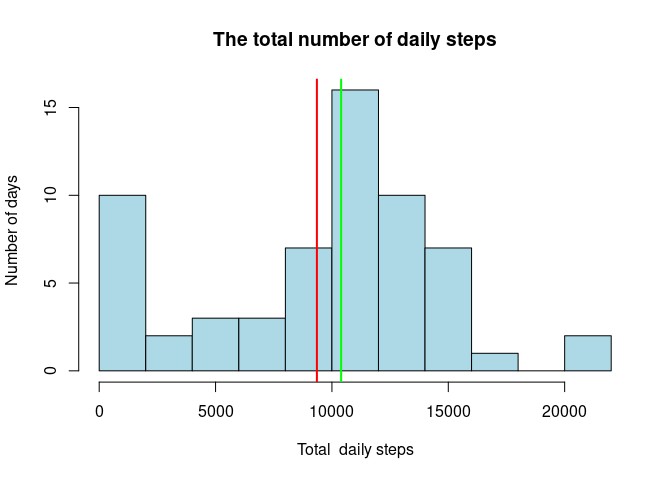
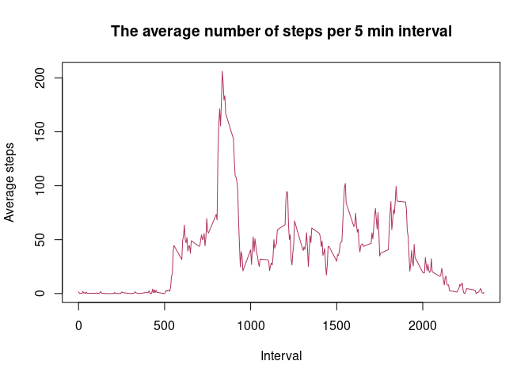
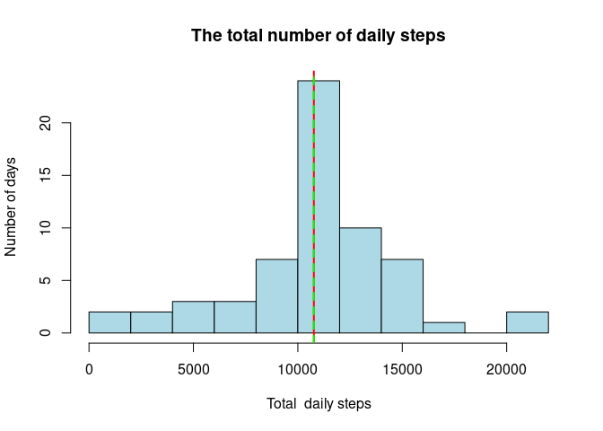
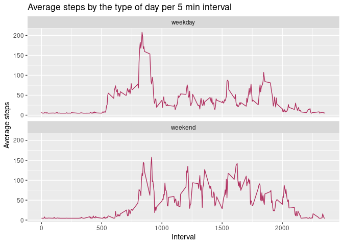

## Loading and preprocessing the data

The first step is to unzip the file, then to read it using the function **read.csv**. We notice that the date column is of character format, thus we transform it into date format. 


```r
if (!file.exists("activity")) { 
        unzip("activity.zip")}
activity<-read.csv("activity.csv")
summary(activity)
```

```
##      steps            date              interval     
##  Min.   :  0.00   Length:17568       Min.   :   0.0  
##  1st Qu.:  0.00   Class :character   1st Qu.: 588.8  
##  Median :  0.00   Mode  :character   Median :1177.5  
##  Mean   : 37.38                      Mean   :1177.5  
##  3rd Qu.: 12.00                      3rd Qu.:1766.2  
##  Max.   :806.00                      Max.   :2355.0  
##  NA's   :2304
```

```r
activity$date <- as.Date(activity$date, "%Y-%m-%d")
summary(activity)
```

```
##      steps             date               interval     
##  Min.   :  0.00   Min.   :2012-10-01   Min.   :   0.0  
##  1st Qu.:  0.00   1st Qu.:2012-10-16   1st Qu.: 588.8  
##  Median :  0.00   Median :2012-10-31   Median :1177.5  
##  Mean   : 37.38   Mean   :2012-10-31   Mean   :1177.5  
##  3rd Qu.: 12.00   3rd Qu.:2012-11-15   3rd Qu.:1766.2  
##  Max.   :806.00   Max.   :2012-11-30   Max.   :2355.0  
##  NA's   :2304
```


## What is mean total number of steps taken per day?

To answer this question we plot a histogram showing the total numbers of daily steps.


```r
daily_activity <- aggregate(activity$steps, by=list(activity$date), FUN= sum, na.rm=TRUE)
names(daily_activity) <- c("date","steps")

hist(daily_activity$steps, breaks=10 , col="lightblue", main="The total number of daily steps", xlab = "Total  daily steps", ylab="Number of days")
abline(v=mean(daily_activity$steps), col="red", lwd = 2)
abline(v=median(daily_activity$steps), col="green", lwd = 2)
```

<!-- -->

```r
mean(daily_activity$steps)
```

```
## [1] 9354.23
```

```r
median(daily_activity$steps)
```

```
## [1] 10395
```

The histogram above shows the total number of steps taken each day, one can see that the histogram doesn't follow any widely known distribution, although it is most similar to a normal distribution. We added the mean and the median to the plot, this shows that the mean which is equal to 9354.23 is smaller than the median which is equal to 10395, therefore while the individual was taking minimum 10395 half of the days, the average of daily steps throughout this study 9354.23 is still smaller. In other words, when the individual was not walking up to 10395 steps, they were taking much less steps in general.

## What is the average daily activity pattern?

After our initial idea of the daily steps, our next interest is the average distribution throughout the day, the following plot illustrates this average per 5 minute interval. 


```r
average_daily_activity <- aggregate(activity$steps, by=list(activity$interval), FUN=mean, na.rm=TRUE)
names(average_daily_activity) <- c("interval", "average_steps")

plot(average_steps ~ interval, data=  average_daily_activity , main="The average number of steps per 5 min interval", ylab = "Average steps", xlab="Interval", type="l", col="maroon")
```

<!-- -->

The histogram above displays the average number of steps taken, averaged across all days, per 5 minute interval. It shows fluctuations throughout the day, but it is clear that some fluctuations are so small that one can assume the normal sleeping hours of this individual. We are interested in the highest active interval also which is 835 calculated by:


```r
average_daily_activity[which.max(average_daily_activity$average_steps),]$interval
```

```
## [1] 835
```

## Imputing missing values

ALl of our analysis for now does not include missing values, let's start by finding how many missing values there is. 


```r
sum(is.na(activity$steps))
```

```
## [1] 2304
```

Let’s use a simple strategy : we’ll fill in all the missing values in the data set with the mean of all steps measured. 


```r
na_index <- is.na(activity$steps)
activity_na_removed <- activity
activity_na_removed[na_index,1]<-mean(activity$steps, na.rm = TRUE)
```

Now, to see the impact of the missing value we plot a similar histogram to the one reporting the daily activity.


```r
daily_activity_na_removed <- aggregate(activity_na_removed$steps, by=list(activity$date), FUN= sum, na.rm=TRUE)
names(daily_activity_na_removed) <- c("date","steps")

hist(daily_activity_na_removed$steps, breaks=10 , col="lightblue", main="The total number of daily steps", xlab = "Total  daily steps", ylab="Number of days")
abline(v=mean(daily_activity_na_removed$steps), col="red", lwd = 2, lty=1)
abline(v=median(daily_activity_na_removed$steps), col="green", lwd = 2,lty=2)
```

<!-- -->

```r
mean(daily_activity_na_removed$steps)
```

```
## [1] 10766.19
```

```r
median(daily_activity_na_removed$steps)
```

```
## [1] 10766.19
```

The first thing one can notice is that the distribution looks more like a normal distribution in this case. The other notable thing is that the mean and the median are equal and both increased to be 10766.19.

## Are there differences in activity patterns between weekdays and weekends?

To try to figure this out, we begin with adding a factor to determine if the day falls on a weekday or a weekend.


```r
activity_na_removed$day <- weekdays(activity_na_removed$date)
for (i in 1:nrow(activity_na_removed)){
        if (activity_na_removed[i,]$day %in% c("Saturday","Sunday")){
                activity_na_removed[i,]$day <- "weekend"}
        else {activity_na_removed[i,]$day <- "weekday"}
        
}
```

Our next step is to plot the 5-minute interval and the average number of steps taken, averaged across all days for weekdays and for the weekend.


```r
average_weekly_activity <- aggregate(activity_na_removed$steps, by=list(activity_na_removed$interval, activity_na_removed$day), FUN=mean)
names(average_weekly_activity) <- c("interval", "day", "average_steps")

library(ggplot2)
g <- ggplot(average_weekly_activity, aes(x = interval , y = average_steps, color = day)) +
     geom_line(col="maroon") +
     labs(title = "Average steps by the type of day per 5 min interval", x = "Interval", y = "Average steps") +
     facet_wrap(~day, ncol = 1, nrow=2)
g
```

<!-- -->

The plot above shows a definite difference between weekdays and weekends, however patterns can not be concluded by the information above, for it is not enough. But one has the impression that steps taken by this individual are fluctuating less byt more severely during the weekday compared to the weekend.
